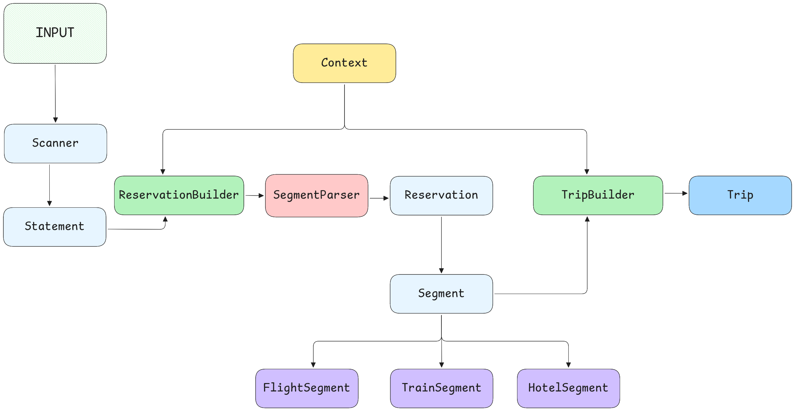

# Reseg

A Ruby gem to parse and format REservation SEGments into organized trips.

## TLDR; Test entrypoint

To validate the code test, run:
```
BASED=SVQ bin/test
```

## Description

Reseg takes raw reservation data containing flights, trains, and hotel bookings in this format:
```
RESERVATION
  SEGMENT: Flight SVQ 2025-01-05 20:40 -> BCN 22:10
  SEGMENT: Flight BCN 2025-01-10 10:30 -> SVQ 11:50

  RESERVATION
  SEGMENT: Hotel BCN 2025-01-05 -> 2025-01-10
```

groups them into trips based on a traveler's home base city, and outputs human-readable itineraries:
```
TRIP TO BCN
Flight from SVQ to BCN at 2025-01-05 20:40 to 22:10
Hotel at BCN on 2025-01-05 to 2025-01-10
Flight from BCN to SVQ at 2025-01-10 10:30 to 11:50
```

### Time Zone Configuration

By default, the time zone is inferred from the base city's IATA code, thanks to the [airports](https://github.com/timrogers/airports) gem. You can override this:

```ruby
Reseg.format(input, based_city: "SVQ", time_zone: "Europe/Madrid")
```

### Format specifications

| Field | Format | Example |
|-------|--------|---------|
| IATA Code | 3-letter code | `SVQ`, `BCN`, `MAD` |
| Date | ISO 8601 extended | `2025-01-05` |
| Time | 24-hour format | `20:40`, `09:30` |

### How trip building works

1. **Parsing**: The input is scanned line by line, extracting reservation blocks and segment data
2. **Context**: The Context defines the traveller's base city and timezone
3. **Segment Creation**: Each segment line is parsed into typed segment objects (Flight, Train, Hotel)
4. **Sorting**: All segments are sorted chronologically by start time
5. **Trip Assembly**:
   - A trip begins when a flight/train departs from the base city
   - A trip ends when a flight/train arrives at the base city
   - Connecting flights within 24 hours are grouped together
6. **Hotel Insertion**: Hotel segments are matched to trips based on location and dates, then inserted after the corresponding arrival segment

### Architecture


